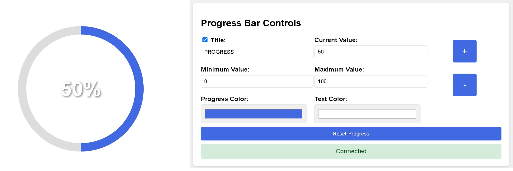

# 🕹️ Progress Bar Control Panel

This project provides a real-time control panel for a circular progress bar, updating live via WebSocket. It allows you to adjust settings like title visibility, progress values, color themes, and more. The instructions below detail setup, usage, and available options.

## ✨ Features

- **Adjustable Title**: Toggle the title visibility and customize the displayed text.
- **Progress Value Controls**: Set minimum, maximum, and current progress values.
- **Color Customization**: Choose colors for the progress bar and text.
- **Real-Time Updates**: Changes update instantly on the progress display through WebSocket.
- **Incremental Adjustment**: Buttons to increase or decrease the current progress value.
- **Reset Function**: Quickly reset progress to zero.

## 🛠️ Requirements

- **Node.js**: Required for setting up a WebSocket server.
- **WebSocket Server**: Configured to connect to `ws://localhost:3000`.

> **Note**: Ensure Node.js is installed on your system. If you’re setting up a WebSocket server locally, you may need to install additional WebSocket dependencies.

## 📥 Installation

1. **Clone or Download** the repository.
3. **Install necessary Node.js packages** (if setting up a WebSocket server locally).
4. **Open control.html** in a browser to access the control panel.
5. **Open progress.html** in a separate browser window or tab to view the progress bar.
6. **Add progress.html location to OBS** as a browser source. Use the File Location as the "URL" (DO NOT ENABLE "LOCAL FILE" CHECKBOX).

> **Important**: The WebSocket server must be running and accessible at ws://localhost:3000 for the app to function.

⚙️ Control Panel Options
------------------------

In the control.html Panel:

*   **Title**:
    
    *   Toggle title visibility with the checkbox next to "Title."
        
    *   Enter a custom title in the input field. This title displays above the progress bar in progress.html.
        
*   **Progress Values**:
    
    *   **Current Value**: Set the current progress value manually.
        
    *   **Minimum Value**: Set the minimum value for progress.
        
    *   **Maximum Value**: Set the maximum value for progress.
        
    *   **Increment/Decrement Buttons**: Adjust the current value by increments of 1 using + and - buttons.
        
*   **Color Options**:
    
    *   **Progress Color**: Choose a color for the progress bar fill.
        
    *   **Text Color**: Set the color for the title and percentage text.
        
*   **Reset Progress**: Resets the progress to the minimum (0).
    

### 🔄 Live Updates

All changes in control.html are sent to progress.html via WebSocket and applied instantly.

🐛 Troubleshooting
------------------

*   **Connection Issues**: If progress.html shows "Disconnected - Refresh to reconnect," ensure the WebSocket server is running.
    
*   **Reconnection**: The app attempts to reconnect every 5 seconds if the WebSocket connection is lost.
